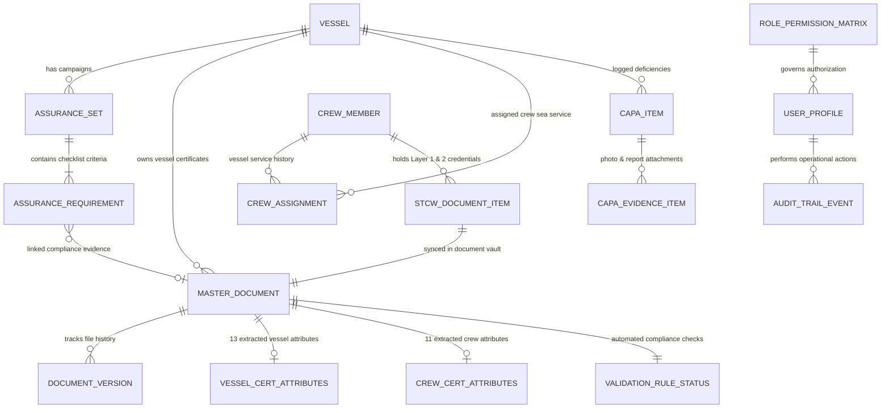
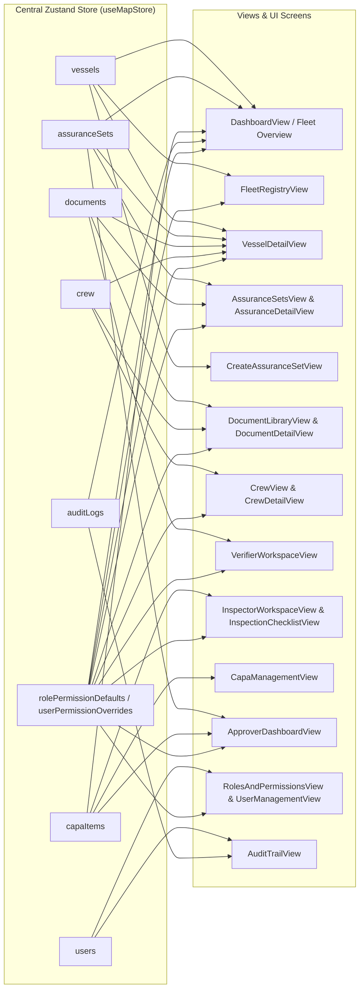

# Marine Assurance Platform (MAP) — Data Architecture, Schemas, and Entity Flow

/* 
  file summary: complete mock data schemas, entity relationships, cross-table connections, and screen-level data usage mapping for map.
  responsibilities: documents all data models, primary/foreign key connections, lifecycle mutations, readiness calculations, and screen-by-screen data consumers.
  role in system: central data architecture reference and developer guide for state management and domain integrity.
*/

## 1. Core Entity Relationship Diagram (ERD)



---

## 2. Complete Data Schemas and Types

### 2.1. Vessel Schema (`VesselParticulars` / `Vessel`)
- **Definition File**: [src/types/vessel.ts](file:///c:/mapFiles/MAP/src/types/vessel.ts)
- **Primary Key**: `id` (e.g., `'VESSEL-001'`)
- **Unique Identifiers**: `imoNumber` (7 digits), `officialRegNumber`, `mmsiNumber` (9 digits), `callSign`

```typescript
export interface VesselParticulars {
  /* category 1 - vessel identification */
  id: string;
  name: string;
  previousNames?: string;
  imoNumber: string;
  officialRegNumber: string;
  mmsiNumber: string;
  callSign: string;
  flagState: string;
  portOfRegistry: string;
  status: 'In Operations' | 'In Transit' | 'Dry Docking' | 'Lay-up' | 'Port Stay' | 'Under Charter';
  complianceReadinessScore: number; /* 0 to 100% computed from active assurance sets */

  /* category 2 - classification & notation */
  vesselType: string;
  vesselSubtype: string;
  intendedUse: string;
  tradingArea: string;
  classificationSociety: 'DNV' | 'ABS' | "Lloyd's Register" | 'Bureau Veritas' | 'RINA';
  classNotation: string;
  hullType: string;
  ispsSolasStatus: string;

  /* category 3 - construction & dimensions */
  yearBuilt: number;
  shipyardBuilder: string;
  lengthOverallMeters: number;
  beamMeters: number;
  draftMeters: number;

  /* category 4 - tonnage & propulsion */
  grossTonnageGT: number;
  deadweightTonnageDWT: number;
  dynamicPositioningClass: string;
  mainEnginePowerKW: string;

  /* category 5 - ownership & management */
  registeredOwner: string;
  ownerType: string;
  corporateRegistryNo: string;
  ismCompany: string;
  technicalManager: string;
  docNumber: string;
  contact247: string;

  /* category 6 - statutory certificates summary */
  statutoryCertificates: StatutoryCertificateSummary[];

  /* category 7 - insurance & p&i coverage */
  hmInsurer: string;
  piClubName: string;
  policyNumber: string;
  policyExpiryDate: string;

  /* category 8 - crew & safety particulars */
  safeManningComplement: number;
  certifiedOfficersRatings: string;
  masterName: string;
  lifeboatCapacity: number;

  /* category 9 - environmental & energy efficiency */
  fuelType: string;
  lowSulphurCompliant: boolean;
  bwtsSpec: string;
  owCalibrationDate: string;

  /* category 10 & 11 - attachments & history */
  masterCertificateUploadCount: number;
  clientHistory: VesselClientHistoryRecord[];
}
```

### 2.2. Assurance Set Schema (`AssuranceSet` & `AssuranceRequirement`)
- **Definition File**: [src/types/assurance.ts](file:///c:/mapFiles/MAP/src/types/assurance.ts)
- **Primary Key**: `id` (e.g., `'AS-2026-001'`)
- **Foreign Key**: `vesselId` $\rightarrow$ `Vessel.id`

```typescript
export interface AssuranceRequirement {
  id: string; /* e.g. 'REQ-101' */
  category: 'Statutory Certificate' | 'Crew Credential' | 'Inspection Report' | 'Environmental';
  title: string;
  isMandatory: boolean;
  isFulfilled: boolean;
  ocrConfidence: number; /* 0 - 100% */
  documentId?: string; /* references masterdocument.id */
  linkedDocumentId?: string;
  documentVersion?: string;
  verifierStatus: 'Pending' | 'Verified' | 'Correction Requested' | 'Rejected';
  verificationRoute?: 'Inspector' | 'Approver';
  notes?: string;
}

export interface AssuranceSet {
  id: string; /* e.g. 'AS-2026-001' */
  title: string;
  vesselId: string; /* foreign key referencing vessel.id */
  vesselName: string;
  imoNumber: string;
  initiatorOrg: string;
  initiatorRole: 'Vessel Provider' | 'Client Admin' | 'C Admin · Client Created' | 'Vessel Provider Admin';
  charterer?: string;
  charterWindowStart: string;
  charterWindowEnd: string;
  stage: 'Initiated' | 'Validation' | 'Verification' | 'Inspection' | 'Approval' | 'Certified' | 'Approved';
  readinessScore: number; /* 0 - 100% computed from verified / approved requirements */
  requirements: AssuranceRequirement[];
  mandatoryInspectionRequired: boolean;
  inspectionCompleted: boolean;
  assignedSubmitter?: string;
  assignedVerifier?: string;
  assignedInspector?: string;
  assignedApprover?: string;
  approverDecision?: 'Approved' | 'Returned for Correction' | 'Rejected' | 'Pending';
  approverNotes?: string;
}
```

### 2.3. Master Document Schema (`MasterDocument`)
- **Definition File**: [src/types/document.ts](file:///c:/mapFiles/MAP/src/types/document.ts)
- **Primary Key**: `id` (e.g., `'DOC-2026-001'`, `'DOC-CRW-101'`)
- **Foreign Key**: `vesselId` $\rightarrow$ `Vessel.id`

```typescript
export interface MasterDocument {
  id: string;
  title: string;
  entityType: 'Vessel Certificate' | 'Crew Certificate';
  vesselId: string; /* foreign key referencing vessel.id */
  certificateNo: string;
  issuingAuthority: string;
  expiryDate: string;
  ocrConfidence: number; /* 0 - 100% */
  complianceState: 'Valid' | 'Expiring < 6 Mos' | 'Mismatch/Exception' | 'Expired';
  currentVersion: string; /* e.g. 'v1.0', 'v1.1' */
  versions: DocumentVersion[];
  vesselAttributes?: VesselCertAttributes; /* 13 extracted vessel attributes */
  crewAttributes?: CrewCertAttributes;     /* 11 extracted crew attributes */
  validationRules: ValidationRuleStatus;
  verificationStatus: 'Pending' | 'Verified' | 'Correction Requested' | 'Rejected';
  verificationNotes?: string;
  fileUrl?: string;
}
```

### 2.4. Crew Member Schema (`CrewMember`)
- **Definition File**: [src/types/crew.ts](file:///c:/mapFiles/MAP/src/types/crew.ts)
- **Primary Key**: `id` (e.g., `'CREW-101'`)
- **Foreign Key**: `currentVesselId` $\rightarrow$ `Vessel.id`

```typescript
export interface STCWDocumentItem {
  id: string; /* synced 1:1 with masterdocument.id */
  title: string;
  layer: 'Layer 1 - Universal Core' | 'Layer 2 - Vessel Specific & Endorsements';
  stcwRegulation: string;
  certificateNo: string;
  issuingAuthority: string;
  flagState?: string;
  issueDate: string;
  expiryDate: string;
  verificationStatus: 'Verified' | 'Pending' | 'Expiring' | 'Expired';
  fileUrl?: string;
  fileName?: string;
  fileSizeBytes?: number;
}

export interface CrewMember {
  id: string;
  fullName: string;
  rank: string;
  nationality: string;
  organization?: string;
  seamansBookNo: string;
  passportNo: string;
  dateOfBirth: string;
  emergencyContact: string;
  currentVesselId?: string;   /* foreign key referencing vessel.id */
  currentVesselName?: string;
  complianceStatus: 'Fully Compliant' | 'Expiring < 60 Days' | 'Document Deficient';
  overallComplianceScore: number;
  lastAuditedDate: string;
  assignments: CrewVesselAssignment[];
  layer1CoreDocuments: STCWDocumentItem[];
  layer2Endorsements: STCWDocumentItem[];
}
```

### 2.5. CAPA Schema (`CapaItem`)
- **Definition File**: [src/types/capa.ts](file:///c:/mapFiles/MAP/src/types/capa.ts)
- **Primary Key**: `id` (e.g., `'CAPA-001'`)
- **Foreign Key**: `vesselId` $\rightarrow$ `Vessel.id`, `checklistId` $\rightarrow$ inspection item

```typescript
export interface CapaItem {
  id: string;
  vesselName: string;
  vesselId?: string;
  checklistId?: string;
  checklistItemTitle: string;
  title: string;
  findingDescription: string;
  owner: string;
  dueDate: string;
  status: 'Open' | 'Under Re-Inspection' | 'Verified & Closed' | 'Rectification Required';
  inspectorNotes?: string;
  evidences: CapaEvidenceItem[];
  createdDate: string;
  lastInspectedDate?: string;
  flaggedForReinspection?: boolean;
  cadminFlagReason?: string;
  flaggedByCAdminDate?: string;
}
```

### 2.6. User Profile & Audit Trail Schemas
- **Definition Files**: [src/types/user.ts](file:///c:/mapFiles/MAP/src/types/user.ts) and [src/types/audit.ts](file:///c:/mapFiles/MAP/src/types/audit.ts)
- **Single C Admin Rule**: Exactly one user account holds the `C Admin` persona (`S. Basin`, `USR-201`).
- **C Admin Mock Users**: Users created under C Admin (`createdBy: 'C Admin'`) belong strictly to the 3 permitted operational roles:
  1. `USR-205` (`D. Harrison` - `Verifier`)
  2. `USR-207` (`Capt. Robert Shaw` - `Inspector`)
  3. `USR-208` (`Elena Gomez` - `Approver`)
- **C Admin Edit & Deactivation**: C Admin possesses update rights (`update: true`) on their created users in the `users` permission scope, allowing them to edit profile metadata and deactivate (`status: 'Inactive'`) or reactivate (`status: 'Active'`) accounts directly from the User Table.

```typescript
export interface UserProfile {
  id: string;
  name: string;
  email: string;
  roles: RoleName[];
  userType: 'Organization' | 'Third-Party';
  organization: string;
  departmentOrScope: string;
  status: 'Active' | 'Pending Invitation' | 'Inactive';
  lastActive: string;
  createdBy?: string;
  invitedBy?: string;
}

export interface AuditTrailEvent {
  id: string;
  timestampUtc: string;
  userId: string;
  userRole: UserRolePersona;
  organization: string;
  action: string;
  targetAsset: string;
  fieldDelta?: {
    fieldName: string;
    oldValue: string;
    newValue: string;
  };
  documentStatusDelta?: {
    documentId: string;
    oldStatus: string;
    newStatus: string;
  };
  justificationNotes?: string;
}
```

---

## 3. Cross-Entity Data Connectivity and References

| Source Entity            | Field / Foreign Key               | Target Entity       | Relationship Type | System Purpose & Data Integrity                                                                |
| :----------------------- | :-------------------------------- | :------------------ | :---------------: | :--------------------------------------------------------------------------------------------- |
| **AssuranceSet**         | `vesselId`                        | `Vessel.id`         |       N : 1       | Links campaign to vessel asset; pulls vessel particulars and synchronizes overall readiness.   |
| **AssuranceRequirement** | `documentId` / `linkedDocumentId` | `MasterDocument.id` |       N : 1       | Binds statutory requirement to specific uploaded file in vault; evaluates verification status. |
| **MasterDocument**       | `vesselId`                        | `Vessel.id`         |       N : 1       | Associates certificate with vessel; scopes document visibility in vessel details.              |
| **CrewMember**           | `currentVesselId`                 | `Vessel.id`         |       N : 1       | Links crew member to active vessel; matches master name (`masterName`) and safe manning.       |
| **STCWDocumentItem**     | `id`                              | `MasterDocument.id` |       1 : 1       | Synchronizes crew credentials with the central document library directory (`state.documents`). |
| **CrewVesselAssignment** | `vesselId`                        | `Vessel.id`         |       N : 1       | Historical sea service tracking across fleet assets.                                           |
| **CapaItem**             | `vesselId`                        | `Vessel.id`         |       N : 1       | Associates inspection non-conformances with specific vessel and inspection checklists.         |
| **AuditTrailEvent**      | `userId`                          | `UserProfile.id`    |       N : 1       | Logs immutable history of who performed actions, their role, and timestamps.                   |

---

## 4. Screen-by-Screen Data Consumption and Impact



### Screen Consumption Details:

1. **Fleet Overview / Dashboard (`DashboardView.tsx`)**:
   - **Data Consumed**: `vessels`, `assuranceSets`, `capaItems`, `auditLogs`.
   - **Calculations**: Aggregates fleet readiness score (average of active assurance sets), count of vessels in operations / under charter, active vetting campaigns, and open CAPA items.
   - **Role Impact**: C Admin sees client-filtered vessels and campaigns; Admin sees fleet-wide operations.

2. **Fleet Registry (`FleetRegistryView.tsx`) & Vessel Detail (`VesselDetailView.tsx`)**:
   - **Data Consumed**: `VesselParticulars`, linked `AssuranceSet`, linked `MasterDocument`, assigned `CrewMember`, `CapaItem`.
   - **Integrity Enforcement**: Vessel status (`In Operations`, `In Transit`, `Under Charter`) is gated against `complianceReadinessScore`. Unapproved vessels ($<100\%$) cannot enter `In Transit` or `Under Charter`.

3. **Assurance Sets (`AssuranceSetsView.tsx`, `AssuranceDetailView.tsx`, `CreateAssuranceSetView.tsx`)**:
   - **Data Consumed**: `AssuranceSet`, `AssuranceRequirement`, `MasterDocument` (unassigned certificates vault), `VesselParticulars`.
   - **Workflow Progression**: Stepper updates from `Initiated` $\rightarrow$ `Validation` $\rightarrow$ `Verification` $\rightarrow$ `Inspection` $\rightarrow$ `Approval` $\rightarrow$ `Approved`. When readiness reaches 100% or Approved, all stepper stages render checked.

4. **Document Library & Vault (`DocumentLibraryView.tsx`, `DocumentDetailView.tsx`)**:
   - **Data Consumed**: `MasterDocument` (33 crew certificates + statutory vessel certificates), version history (`DocumentVersion`), OCR extraction payloads.
   - **Dynamic Synchronization**: When crew members or crew documents are added/updated via store mutations, `state.documents` automatically registers and updates the corresponding `MasterDocument` records.

5. **Crew Directory (`CrewView.tsx`, `CrewDetailView.tsx`)**:
   - **Data Consumed**: `CrewMember`, `STCWDocumentItem`, `CrewVesselAssignment`.
   - **Cross-Links**: Captain (`masterName`) and Chief Engineer are cross-checked against `VesselParticulars` and statutory safe manning requirements.

6. **Verifier Workspace (`VerifierWorkspaceView.tsx`)**:
   - **Data Consumed**: `MasterDocument` queue where `verificationStatus === 'Pending'`.
   - **UI Output**: Side-by-side split screen showing PDF preview, OCR extracted attributes (13 vessel / 11 crew), validation rules, and decision controls.

7. **Inspector Workspace & Checklist (`InspectorWorkspaceView.tsx`, `InspectionChecklistView.tsx`)**:
   - **Data Consumed**: Assigned `AssuranceSet`, `VesselParticulars`, inspection checklist items, `CapaItem`.
   - **Actions**: Records item findings (Satisfactory / Observation / Deficiency), creates `CapaItem`, attaches photo evidence.

8. **CAPA Management (`CapaManagementView.tsx`)**:
   - **Data Consumed**: `CapaItem`, `CapaEvidenceItem`, `VesselParticulars`.
   - **Actions**: Rectification submission, re-inspection closeout, and C Admin re-inspection flagging (`cadminFlagReason`).

9. **Approver Dashboard (`ApproverDashboardView.tsx`)**:
   - **Data Consumed**: `AssuranceSet` dossiers, readiness calculations, verified `MasterDocument` records, closed CAPA summaries.
   - **Actions**: Final sign-off dial, authorization comments, setting `approverDecision: 'Approved'`, and certifying the campaign.

10. **Roles & Permissions Matrix (`RolesAndPermissionsView.tsx`)**:
    - **Data Consumed**: `RolePermissionMatrix`, `PermissionScopeDefinition` (28 scopes), `UserPermissionOverrides`, `UserProfile`.
    - **Actions**: Dynamic toggling of CRUD permissions for custom roles or users, resetting to BRD defaults, and hard-deny lock enforcement.
