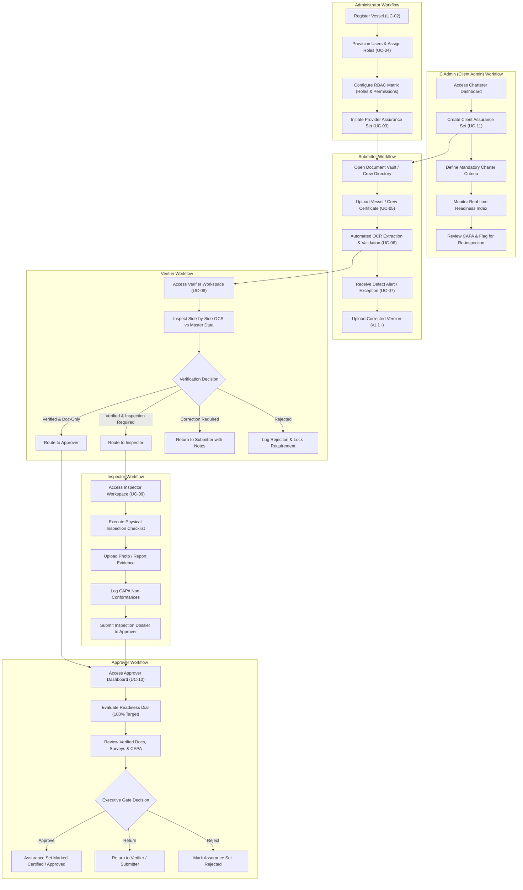

# Marine Assurance Platform (MAP) — Role Architecture, Workflows, and Permission Matrix

/* 
  file summary: comprehensive role-based access control (rbac) documentation, role workflows, screen visibility matrices, and permission engine interactions for map.
  responsibilities: details permissions, allowed/restricted actions, operational workflows, and screen visibility for all 6 personas under static defaults and dynamic matrix overrides.
  role in system: system specification and architectural blueprint for authorization boundaries across all client views, routes, components, and zustand store handlers.
*/

## 1. System Role Personas Overview

The Marine Assurance Platform enforces strict Segregation of Duties (SoD) across 6 distinct user personas:

1. **Administrator (Vessel Provider / Owner Admin)**: Full administrative authority over vessel registration, fleet metadata, user provisioning, global RBAC settings, and provider-initiated assurance campaigns.
2. **C Admin (Client / Charterer Admin)**: Administrative authority for charterers and clients; initiates charter assurance sets, defines mandatory vetting requirements, reviews compliance readiness, and flags items for re-inspection. Prohibited from mutating provider-owned documents.
3. **Submitter (Vessel Provider Document Controller)**: Responsible for uploading, versioning, and managing statutory vessel certificates and STCW crew credentials. Resolves verification exceptions and re-submits rectified evidence.
4. **Verifier (Marine Surveyor / Technical Auditor)**: Validates OCR extraction results, cross-checks certificate attributes against master registries, evaluates 6-month charter validity buffers, and renders verification decisions (Verify, Request Correction, Reject).
5. **Inspector (On-Site Marine Inspector / Surveyor)**: Conducts physical surveys, executes inspection checklists, records visual survey findings, uploads photographic evidence, logs CAPA non-conformances, and re-inspects remediated items.
6. **Approver (Assurance Manager / Marine Superintendent)**: Evaluates complete assurance dossiers (verified certificates, inspection reports, CAPA closures, and readiness scores) to issue final authorization or formal rejection of the Assurance Set.

---

## 2. End-to-End Operational Workflow by Role



---

## 3. Detailed Role Specifications

### 3.1. Administrator (Vessel Provider Admin)
- **Primary Stakeholder**: Vessel Provider / Fleet Management Executive.
- **Permitted Actions**:
  - Register new vessels across all 11 particulars categories with duplicate IMO/Official Number validation checks.
  - Create and configure Assurance Sets and link participating organizations.
  - Manage user accounts, invite external stakeholders, and assign operational roles.
  - Configure global Permission Matrix defaults and per-user overrides.
  - Access all operational workspaces (Document Upload, Verifier, Inspector, Approver, Audit Trail).
- **Prohibited Actions**:
  - Cannot register duplicate vessels with conflicting IMO or official registration numbers.
  - Cannot alter, overwrite, or delete immutable audit trail records.
  - Cannot violate segregation of duties where hard BRD policy locks apply.

### 3.2. C Admin (Client Admin / Charterer)
- **Primary Stakeholder**: Charterer, Energy Major, or Cargo Owner Assurance Lead (`S. Basin` - Single C Admin in system).
- **Single C Admin Rule**: The platform maintains exactly one Client Admin (`C Admin`) account representing the lead charterer organization (`Southern Basin Energy`).
- **User Provisioning & Management Privileges**:
  - C Admin is authorized to provision/invite mock users under their administrative boundary.
  - Allowed Operational Roles for C Admin Provisioning: **Verifier**, **Inspector**, and **Approver** (e.g. Third-party auditors, surveyors, and client approvers).
  - Edit & Lifecycle Controls: C Admin can edit profile details (name, email, roles, organization, scope) and toggle account status (**Active** $\leftrightarrow$ **Inactive** / Deactivate) for any user created under their boundary.
  - Prohibited Roles for Provisioning: Cannot provision `Administrator`, `C Admin`, or `Submitter` accounts.
- **Permitted Actions**:
  - View fleet readiness overview and track assurance pipeline stages.
  - Initiate client-specific Assurance Sets with customized compliance requirements.
  - Monitor live validation scores, verification stages, and inspection progress.
  - Review CAPA items and flag resolved findings for physical re-inspection.
  - Manage, invite, edit, and deactivate third-party auditors and client approvers in the User Management Directory (`/users`).
  - Access read-only views of vessel particulars, crew lists, and approved dossiers.
- **Prohibited Actions**:
  - **Strict Prohibition**: Cannot upload, edit, replace, or delete provider-owned certificates or documents.
  - Cannot register vessels or modify master vessel particulars.
  - Cannot perform user administration or role allocation for the vessel provider's internal staff.
  - Cannot directly approve assurance sets unless granted delegated approver authority.

### 3.3. Submitter
- **Primary Stakeholder**: Vessel Provider Document Controller / Compliance Officer.
- **Permitted Actions**:
  - Upload statutory vessel certificates and STCW crew credentials to the central document vault.
  - Link vault documents to specific requirements in active Assurance Sets.
  - Maintain document versioning (v1.0, v1.1, etc.) with change summaries.
  - Receive automated exception alerts (OCR low confidence, expiry, metadata mismatch) and submit corrected files.
- **Prohibited Actions**:
  - Cannot verify, request correction on, or reject submitted documents.
  - Cannot access the Verifier Workspace or Approver Gate.
  - Cannot conduct physical surveys or complete inspector checklists.

### 3.4. Verifier
- **Primary Stakeholder**: Technical Marine Auditor / Marine Assurance Surveyor.
- **Permitted Actions**:
  - Access the Verifier Workspace and review documents in the pending verification queue.
  - Inspect OCR-extracted metadata side-by-side with original uploaded documents.
  - Validate against master vessel data (13 vessel attributes) and crew registers (11 crew attributes).
  - Execute verification decisions: Verify, Request Correction (with mandatory notes), or Reject.
  - Route verified requirements forward to the Inspector (if visual survey required) or Approver Gate.
- **Prohibited Actions**:
  - Cannot upload or modify certificates directly on behalf of submitters.
  - Cannot grant final Assurance Set sign-off or executive approval.
  - Cannot replace the Inspector for physical on-site survey execution.

### 3.5. Inspector
- **Primary Stakeholder**: On-Site Marine Surveyor / Field Inspector.
- **Permitted Actions**:
  - Access Inspector Workspace and assigned physical survey protocols.
  - Execute structured inspection checklists across hull, machinery, LSA/FFA, bridge, and environmental systems.
  - Upload survey reports, photographic evidence, and test certificates.
  - Create and manage Corrective and Preventive Action (CAPA) items with target due dates.
  - Re-inspect flagged deficiencies and close out rectified CAPA items.
- **Prohibited Actions**:
  - Cannot perform desktop certificate verification in place of the Verifier.
  - Cannot upload statutory vessel master certificates.
  - Cannot issue final charter approval for the Assurance Set.

### 3.6. Approver
- **Primary Stakeholder**: Marine Assurance Superintendent / Executive Approver.
- **Permitted Actions**:
  - Access the Approver Dashboard and review verified dossiers.
  - Evaluate compliance readiness scores, statutory certificate validity, and closed CAPA items.
  - Authorize formal approval of individual requirements and complete the Assurance Set.
  - Return dossiers for correction or issue formal rejections with executive commentary.
- **Prohibited Actions**:
  - Cannot upload certificates or modify technical metadata.
  - Cannot perform initial document verification or physical survey execution.
  - Cannot approve an Assurance Set if mandatory statutory certificates remain unverified or expired.

---

## 4. UI Screen Visibility and Role Access Matrix

| UI Screen / View | Route | Admin | C Admin | Submitter | Verifier | Inspector | Approver |
| :--- | :--- | :---: | :---: | :---: | :---: | :---: | :---: |
| **Login View** | `#/login` | Read/Write | Read/Write | Read/Write | Read/Write | Read/Write | Read/Write |
| **Fleet Overview / Dashboard** | `#/` or `#/dashboard` | Read/Write | Read | Read | Read | Read | Read |
| **Fleet Registry** | `#/vessels` | Read/Write | Read | Read | Read | Read | Read |
| **Vessel Detail View** | `#/vessels/:id` | Read/Write | Read | Read/Update | Read | Read | Read |
| **Vessel Registration Form** | `#/vessels/register` | Read/Write | Hidden | Hidden | Hidden | Hidden | Hidden |
| **Assurance Sets View** | `#/assurance-sets` | Read/Write | Read/Write | Read | Read | Read | Read/Write |
| **Assurance Detail View** | `#/assurance-sets/:id` | Read/Write | Read | Read | Read/Update | Read/Update | Read/Update |
| **Create Assurance Set View** | `#/assurance-sets/create` | Read/Write | Read/Write | Hidden | Hidden | Hidden | Hidden |
| **Document Library View** | `#/documents` | Read/Write | Read | Read/Write | Read | Read | Read |
| **Document Detail View** | `#/documents/:id` | Read/Write | Read | Read/Write | Read/Update | Read | Read |
| **Crew Directory View** | `#/crew` | Read/Write | Read | Read/Write | Read | Read | Read |
| **Crew Detail View** | `#/crew/:id` | Read/Write | Read | Read/Write | Read | Read | Read |
| **Verifier Workspace** | `#/verifier` | Read/Write | Hidden* | Hidden | Read/Write | Hidden | Hidden |
| **Inspector Workspace** | `#/inspector` | Read/Write | Hidden | Hidden | Hidden | Read/Write | Hidden |
| **Inspection Checklist View** | `#/inspections/:id` | Read/Write | Read | Hidden | Hidden | Read/Write | Read |
| **CAPA Management View** | `#/capa` | Read/Write | Read/Update* | Read | Read | Read/Write | Read |
| **Approver Dashboard View** | `#/approver` | Read/Write | Hidden | Hidden | Hidden | Hidden | Read/Write |
| **Roles & Permissions View** | `#/roles-permissions` | Read/Write | Hidden | Hidden | Hidden | Hidden | Hidden |
| **User Management View** | `#/users` | Read/Write | Hidden | Hidden | Hidden | Hidden | Hidden |
| **Audit Trail View** | `#/audit` | Read | Read | Read | Read | Read | Read |

*Note: C Admin has read-only access to CAPA with the specific privilege to flag resolved findings for re-inspection (`cadminFlagReason`). C Admin may access Verifier screens only when assigned delegated Verifier rights in the project agreement.*

---

## 5. Permission Matrix Engine and Scopes

The platform authorization layer computes effective permissions through three hierarchical tiers:

```
Effective Permission = (BRD Hard Deny Override) 
                     -> (Per-User Permission Override) 
                     -> (Role Default Matrix) 
                     -> (Default Empty Deny)
```

### 5.1. Permission Categories and Scopes (28 Scopes)

1. **Setup & Configuration**:
   - `vessels`: Vessel registration and core asset particulars.
   - `vessel_status`: Operational status toggles (In Operations, In Transit, Dry Docking, Lay-up, Port Stay, Under Charter).
   - `assurance_sets`: Creation and configuration of assurance projects.
   - `assurance_requirements`: Scope requirement matrix toggles.
   - `workflow_assignment`: Assigning users to assurance roles.
   - `third_party_delegation`: Setting time-bound third-party access scopes.
   - `users`: User provisioning and status management.
   - `role_rights`: Permission matrix configuration.
   - `validation_thresholds`: OCR confidence and validity buffer thresholds.
2. **Crew**:
   - `crew`: Crew profile creation, sea service assignments, and contact records.
   - `crew_certificates`: STCW Layer 1 core certificates and Layer 2 endorsements.
3. **Documents & Submission**:
   - `documents`: Document upload and metadata entry.
   - `document_vault`: Pre-assurance master vault storage.
   - `document_linking`: Associating vault documents with active assurance sets.
   - `document_exceptions`: Reviewing and resolving exception notifications.
4. **Verification**:
   - `verification_queue`: Accessing pending verification work queues.
   - `verification_decisions`: Executing Verify, Request Correction, and Reject actions.
   - `ocr_results`: Side-by-side review of extracted data against master records.
5. **Physical Inspection & CAPA**:
   - `inspection_workspace`: Accessing survey protocols and checklists.
   - `inspection_findings`: Recording condition observations and deficiency notes.
   - `inspection_evidence`: Uploading photo packs and survey reports.
   - `post_inspection_review`: Reviewing survey outcomes and inspector recommendations.
   - `capa`: Logging, managing, and closing corrective action plans.
6. **Approval**:
   - `approval_gate`: Accessing executive authorization queues.
   - `approval_decisions`: Approving or rejecting requirements and sets.
   - `assurance_completion`: Issuing final assurance certification.
7. **Visibility & Compliance**:
   - `dashboard`: Fleet-wide readiness dashboards and metrics.
   - `audit_trail`: Tamper-evident immutable audit log viewer.
   - `compliance_export`: Generating compliance dossiers and regulatory exports.

### 5.2. Hard Business Rule Locks (Hard Deny)

The Permission Matrix UI enforces un-checkable locks on actions that violate fundamental BRD segregation of duties:
- **C Admin**: Create/Update/Delete on `documents`, `document_vault`, `crew_certificates` locked to `false`.
- **Submitter**: Create/Update/Delete on `verification_decisions`, `approval_decisions`, `inspection_findings` locked to `false`.
- **Verifier**: Create/Update/Delete on `documents`, `approval_decisions`, `inspection_findings` locked to `false`.
- **Inspector**: Create/Update/Delete on `verification_decisions`, `approval_decisions`, `documents` locked to `false`.
- **Approver**: Create/Update/Delete on `documents`, `verification_decisions`, `inspection_findings` locked to `false`.