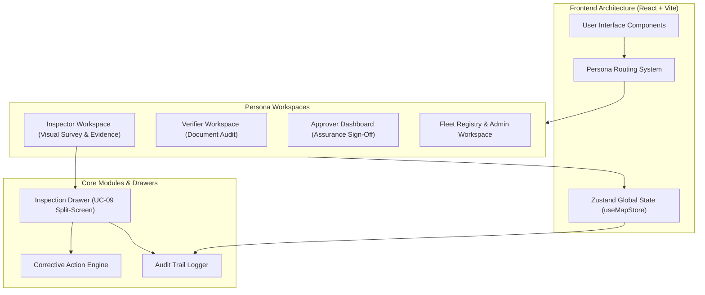
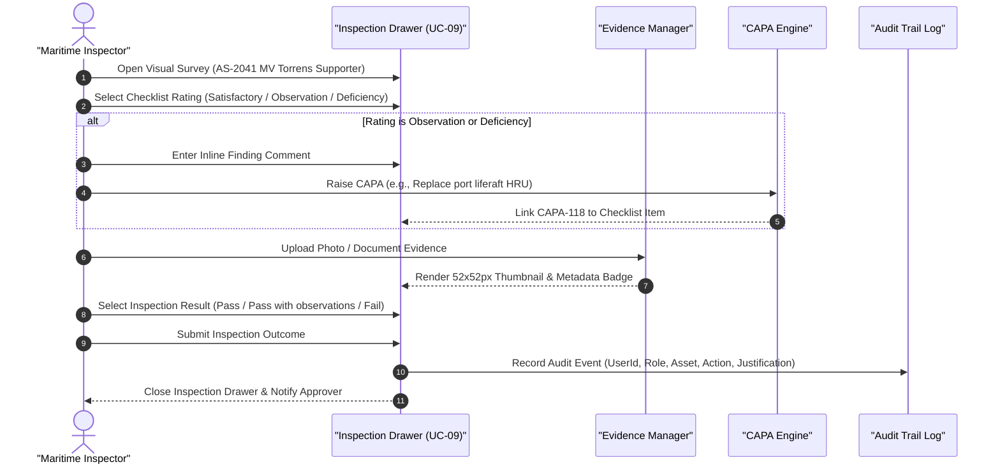
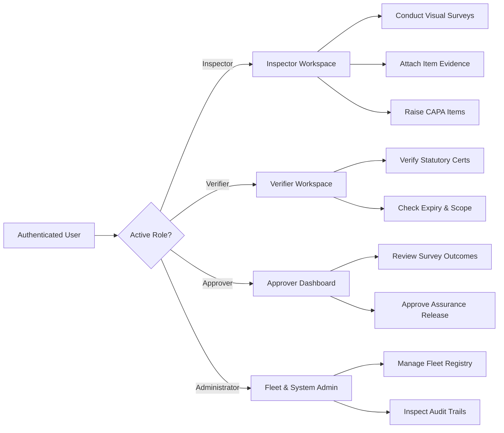

# Marine Assurance Platform (MAP)

## Executive Overview

The Marine Assurance Platform (MAP) is an enterprise-grade web application designed for statutory vessel inspections, marine document verification, regulatory compliance tracking, and corrective action management (CAPA). Built for maritime inspectors, verifiers, approvers, and fleet administrators, MAP ensures complete compliance with SOLAS, MARPOL, ISM Code, and STCW international standards.

---

## Core System Features

### 1. Statutory Visual Vessel Inspection
- **Split-Screen Inspection Workspace**: High-density split-screen interface displaying statutory checklist items alongside inspection result selection and corrective action tracking.
- **Categorized Evidence Attachments**: Item-level evidence attachment system supporting photo and document file uploads with thumbnail previews (52x52px visual previews, file sizes, and metadata).
- **Inline Finding Comments**: Immediate observation and deficiency note recording per checklist item.
- **Direct CAPA Generation**: Ability to raise Corrective Action Preventive Action (CAPA) items directly from checklist findings with assigned owners and due dates.
- **Smart Outcome Recommendation**: Automated outcome suggestions (`Pass`, `Pass with observations`, `Fail`) based on checklist item ratings.

### 2. Multi-Persona Workspaces & Governance
- **Role-Based Access Control**: Dedicated views tailored for four core maritime personas:
  - **Inspector**: Conducts physical vessel surveys, records findings, uploads evidence, and submits survey outcomes.
  - **Verifier**: Audits uploaded certificates, verifies statutory document validity, and checks compliance records.
  - **Approver**: Reviews inspection findings, approves/rejects vessel assurance requirements, and manages risk releases.
  - **Administrator**: Oversees fleet registries, configures assurance rules, and monitors system-wide audit logs.
- **User Authentication**: Secure multi-role login interface with role switching and profile management.

### 3. Audit Trail & Compliance Verification
- **Immutable Log Tracking**: Every inspection action, outcome submission, evidence upload, and CAPA creation is logged with timestamps, user IDs, roles, organizations, and justification notes.
- **Filtering & Export**: Searchable audit trail table filtered by asset name, date range, user role, and event severity.

### 4. Responsive Enterprise Design
- **Full-Height Connected Layout**: 100vh full-height left navigation sidebar seamlessly joined with top header navigation banner.
- **Maritime Primary Color Palette**: Styled using deep navy primary (`rgb(11, 27, 43)`), slate accents, clean typography (IBM Plex Sans & Arial), and responsive breakpoints across desktop, tablet, and mobile devices.

---

## System Architecture Diagram



---

## Visual Vessel Inspection Workflow Diagram



---

## Role-Based Access Control Diagram



---

## Codebase Directory Structure

```
c:/mapFiles/MAP/
├── src/
│   ├── components/
│   │   ├── drawers/
│   │   │   └── InspectionDrawer.tsx       # UC-09 visual vessel survey modal
│   │   ├── layout/
│   │   │   ├── AppHeader.tsx              # Top navigation header
│   │   │   └── AppSidebar.tsx             # 100vh left navigation sidebar
│   │   ├── tables/                        # Data tables (audit trail, fleet)
│   │   └── common/                        # Reusable badges, buttons, cards
│   ├── store/
│   │   └── useMapStore.ts                 # Zustand store for audit logs & persona state
│   ├── types/
│   │   └── index.ts                       # TypeScript interfaces for vessel, audit & CAPA
│   ├── views/
│   │   ├── InspectorWorkspaceView.tsx     # Inspector survey management
│   │   ├── VerifierWorkspaceView.tsx      # Verifier document audit
│   │   ├── ApproverDashboardView.tsx      # Approver sign-off dashboard
│   │   ├── AuditTrailView.tsx             # System audit event logs
│   │   ├── FleetRegistryView.tsx          # Vessel fleet management
│   │   ├── VesselDetailView.tsx           # Single vessel assurance overview
│   │   ├── DocumentDetailView.tsx         # Document verification detail view
│   │   └── LoginView.tsx                  # Role authentication screen
│   ├── App.tsx                            # Root routing layout
│   ├── main.tsx                           # React entry point
│   ├── index.css                          # Global typography & color tokens
│   └── App.css                            # Layout stylesheet
├── package.json                           # Project dependencies
├── tsconfig.json                          # TypeScript configuration
└── vite.config.ts                         # Vite build configuration
```

---

## Getting Started

### Prerequisites
- **Node.js**: v18.0.0 or higher
- **npm**: v9.0.0 or higher

### Installation

1. Navigate to the project directory:
   ```bash
   cd c:/mapFiles/MAP
   ```

2. Install dependencies:
   ```bash
   npm install
   ```

3. Launch development server:
   ```bash
   npm run dev
   ```

4. Build for production:
   ```bash
   npm run build
   ```

---

## Technology Stack

- **Framework**: React 18 with TypeScript
- **Build Tool**: Vite
- **State Management**: Zustand
- **Styling**: Bootstrap 5 + Vanilla CSS Design Tokens
- **Icons & Visuals**: Inline SVG Marine Vector Graphics
- **Diagrams**: MermaidJS Syntax

---

## Quality Assurance & Testing

Unit tests and build verifications are run using standard NPM scripts:

```bash
# Run TypeScript compilation and Vite build check
npm run build
```
